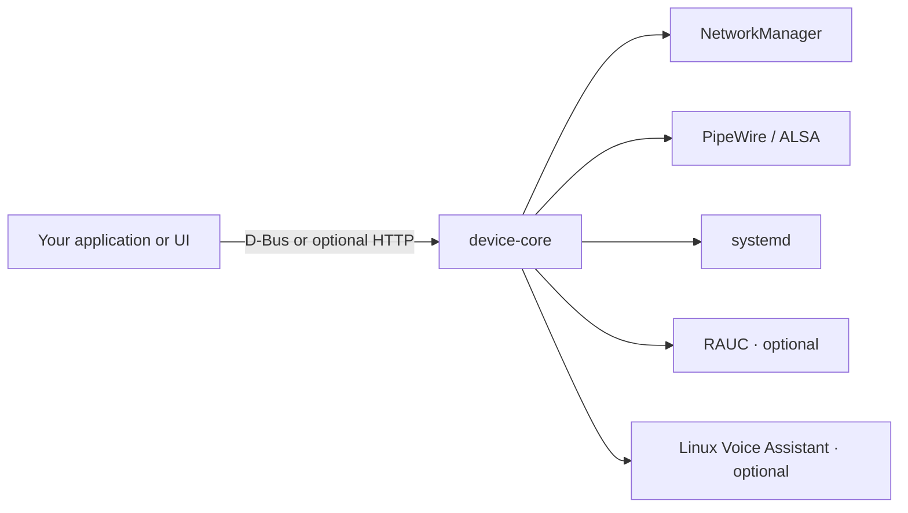

# device-core

**Give your Linux device one service for Wi-Fi, audio, settings and updates.**

device-core is a Rust daemon for developers building connected Linux devices.
Your application asks it to connect to a network, play a sound, save a setting or
install an image update through D-Bus or optional HTTP APIs. It coordinates the
Linux services behind those requests and reports their progress.

[Try it](#try-it-without-hardware) · [Install](#install-on-your-device) ·
[Integrate](#connect-your-application) · [Documentation](#go-further)

## Why use it?

A connected device needs more than its main application: a way to configure
Wi-Fi, recover a lost connection, play feedback, keep preferences across restarts
and update its system. These operations also need to cooperate: an image update
must account for audio playback, voice activity and the application's own work.

device-core gives your UI, local application and automation clients a shared
place to manage those tasks. You work with device-level operations and state;
it handles the integration with NetworkManager, the audio stack, systemd and
optional update and voice services.

Originally extracted from NabOS, it can run independently of Nabaztag hardware
and MQTT. Your application provides the product experience: hardware drivers,
buttons, animations, accounts and application-specific settings.

## What can you do with it?

| You want to… | device-core provides |
| --- | --- |
| **Connect and recover Wi-Fi** | Scan networks, connect, cancel an attempt, manage saved profiles and recover through retries or a fallback hotspot. Uses NetworkManager. |
| **Play feedback and media** | Play MP3/WAV files from approved directories or loopback HTTP streams, adjust volume, stop playback and observe its outcome. One playback runs at a time. |
| **Keep device preferences** | Persist locale, timezone, desired volume, voice enablement and update policy. Revision checks prevent one client from overwriting another client's changes. |
| **Manage the system** | Inspect clock quality and connectivity, set time, manage validated SSH public keys, reboot or power off. |
| **Connect a voice assistant** | Enable a configured Linux Voice Assistant service, observe its state and events, and send commands. Requires an external assistant. |
| **Update the device image** | Discover releases, verify download checksums, resume downloads, install through RAUC and track recovery. Automatic installation windows are optional. |
| **Coordinate maintenance** | Check audio and voice activity, and ask registered product services to reserve inactivity before update or power operations. Requires cooperating services for product-specific activity. |

Voice and online updates are optional integrations. The core service remains
usable when they are not configured. Capability discovery reports configuration;
read each domain's status to determine whether its backend is available.

## How it works



Clients read the current state, request an operation and follow events as it
progresses. D-Bus signals and HTTP Server-Sent Events expose the same domain
events. Both transports share the daemon's settings and operation state.

## Try it without hardware

Use simulation to explore the API on a Linux development machine. You need
Rust/Cargo, D-Bus tools (`dbus-run-session`) and `curl`; the repository pins its
Rust toolchain in [rust-toolchain.toml](rust-toolchain.toml).

From a checkout of this repository, build and start the daemon:

```sh
cargo build --locked

dbus-run-session -- sh -c '
  export DEVICE_CORE_BUS_ADDRESS="$DBUS_SESSION_BUS_ADDRESS"
  export DEVICE_CORE_DATA_DIR="$(mktemp -d)"
  export DEVICE_CORE_NETWORK_GUARD="$DEVICE_CORE_DATA_DIR/network.lock"
  export DEVICE_CORE_HTTP_ADDR=127.0.0.1:8081
  exec ./target/debug/device-core --simulate
'
```

This starts a private D-Bus, stores settings in a temporary directory and enables
HTTP on loopback. Simulation does not change the host clock or power state, call
NetworkManager, run audio decoders or control the voice assistant.

In another terminal, check that the service is ready and inspect its settings:

```sh
curl -fsS http://127.0.0.1:8081/v1/health
curl -fsS http://127.0.0.1:8081/v1/config
```

The health response includes `"ready":true`, a version and an instance identifier.
The configuration response includes a revision and the current settings.

Change the simulated runtime volume, then read the audio state:

```sh
curl -fsS -X PUT http://127.0.0.1:8081/v1/audio/volume \
  -H 'Content-Type: application/json' -d '{"percent":35}'
curl -fsS http://127.0.0.1:8081/v1/audio
```

Follow live events with:

```sh
curl -N http://127.0.0.1:8081/v1/events
```

Press Ctrl+C to stop the event stream or daemon. The private bus exits with the
daemon; the temporary settings directory can be removed when you finish.
Runtime volume changes are temporary. Use Config to save the desired volume.

## Install on your device

Choose an archive from [GitHub releases](https://github.com/guilhem/device-core/releases)
that matches your Linux image:

| Device architecture | Archive | glibc baseline |
| --- | --- | --- |
| ARMv6, hard-float | `device-core-arm-unknown-linux-gnueabihf.tar.gz` | 2.41 |
| ARM64 | `device-core-aarch64-unknown-linux-gnu.tar.gz` | 2.39 |
| x86-64 | `device-core-x86_64-unknown-linux-gnu.tar.gz` | 2.39 |

Pin a release version and verify its checksum before incorporating it into your
image. Each archive includes the daemon, README, GPL license and notices.
Releases also include `sha256.sum`, individual archive checksums, a source archive
and `dist-manifest.json`.

For example, after downloading the x86-64 archive and its `.sha256` file:

```sh
sha256sum --check device-core-x86_64-unknown-linux-gnu.tar.gz.sha256
tar -xzf device-core-x86_64-unknown-linux-gnu.tar.gz
./device-core-x86_64-unknown-linux-gnu/device-core --version
```

You can also build from source with `cargo build --release --locked`.

### Prepare the Linux integration

Your device image supplies the service unit, backend services and permissions.
Configure these before running the daemon without `--simulate`:

| Requirement | What to provide |
| --- | --- |
| **Persistent storage** | A writable `DEVICE_CORE_DATA_DIR` for settings and journals. Default: `/var/lib/device-core`; NabOS uses `/data/device-core`. |
| **Runtime directories** | A stable network lock under `/run` and a working directory under `/run`. Keep the lock file in place across daemon restarts. |
| **D-Bus authorization** | Narrow system-bus and polkit permissions. Linux caller authorization requires process descriptors (`GetConnectionCredentials.ProcessFD`) and systemd 255+ (`GetUnitByPIDFD`). |
| **Networking** | NetworkManager and a Wi-Fi interface. Configure `DEVICE_CORE_PRESENCE_UNIT` when physical-presence authorization is needed for setup. |
| **Audio** | The correct PipeWire session, ALSA output, `mpg123`, `aplay` and `wpctl`. Configure `DEVICE_CORE_ALSA_DEVICE` and approved `DEVICE_CORE_AUDIO_ROOTS`. |
| **SSH keys** | `ssh-keygen` for public-key validation. |
| **Voice, if used** | Linux Voice Assistant and `DEVICE_CORE_LVA_UNIT`. |
| **Online updates, if used** | RAUC, `DEVICE_CORE_UPDATE_REPO` and `DEVICE_CORE_UPDATE_ASSET`, plus the image's update and boot-health integration. |
| **Product maintenance, if used** | Participating systemd services listed in `DEVICE_CORE_MAINTENANCE_UNITS`. |

The default transport is the system D-Bus. **HTTP has no authentication and is
disabled by default.** Setting `DEVICE_CORE_HTTP_ADDR` enables control endpoints,
including power and SSH settings. Keep it on loopback for local use; remote access
needs an authenticated access layer supplied by your integration.

Use narrow service permissions; device-core does not need raw hardware
capabilities. On an immutable image, place persistent state on a writable data
partition. NabOS owns its own systemd and read-only image integration.

## Connect your application

Use the [D-Bus contract](docs/dbus.xml) for on-device clients or the
[OpenAPI contract](docs/openapi.json) for HTTP clients.

| Interface | Entry point |
| --- | --- |
| D-Bus service | `io.github.guilhem.DeviceCore1` |
| D-Bus root object | `/io/github/guilhem/DeviceCore1` |
| HTTP API, when enabled | `/v1` |
| Live HTTP events | `/v1/events` (Server-Sent Events) |

Build your client around these rules:

1. **Discover and read state.** Read Manager's capabilities and the domains you
   use. Optional backend configuration and availability affect what can run.
2. **Follow operations.** Retain returned operation IDs and use status, events or
   wait methods to observe completion. Audio IDs identify a specific playback,
   including the daemon instance, so a stale stop cannot interrupt a later one.
3. **Refresh after reconnecting.** Re-read snapshots after D-Bus `Resync`, SSE
   `resync`, or a change to Manager's `Instance`.
4. **Save settings with their revision.** Read Config, modify its settings and
   submit the returned revision with the update. Successful writes are flushed
   to durable storage. Keep application-specific settings in your application.

After a Config or SSH-key write error, re-read the settings or keys and their
revision before retrying: the change may already have been saved.

Network guards and physical-presence reporting are D-Bus-only operations.
Guards use locked file descriptors; closing all copies releases the guard.
Physical-presence reports require original monotonic button timestamps from the
configured, authenticated service. See [network integration](docs/network.md).

Update recovery can temporarily block new activity. A pending or uncertain RAUC
operation keeps maintenance active until recovery is conclusive. Accepted update
operations continue if the requesting client disconnects; clients should inspect
the update state when they reconnect.
Automatic installation defaults off and requires reliable time and maintenance
admission. Manual installs require an explicit reboot to activate the new image.

## Go further

| Guide | What it covers |
| --- | --- |
| [Network](docs/network.md) | Wi-Fi setup, recovery, physical presence and connection guards. |
| [Audio](docs/audio.md) | Accepted sources, playback ownership, outcomes and volume. |
| [Configuration](docs/config.md) | Settings schema, defaults, validation and revision checks. |
| [System](docs/system.md) | Clock, connectivity, SSH keys and power controls. |
| [Voice](docs/voice.md) | Assistant configuration, state, events and commands. |
| [Updates](docs/updates.md) | Releases, local bundles, scheduling, installation and recovery. |
| [Maintenance](docs/maintenance.md) | Product-agent registration and inactivity reservations. |

## Development and validation

```sh
cargo test --locked
cargo build --locked
python3 tools/dbus-contract.py --check
```

After changing a D-Bus interface, rebuild and regenerate its XML with
`python3 tools/dbus-contract.py`. The contract check starts a daemon on a private
bus. Host tests exercise simulated backends and concurrency; release checks
inspect archive contents, architecture, libc requirements and `--version`, using
QEMU ARM1176 for ARMv6.

These checks complement validation on your target hardware. Device boot,
read-only root operation, audio calibration, real RAUC rollback and power-loss
behavior require device testing.

<details>
<summary>Maintainers: publish a release</summary>

Publication uses [cargo-dist](https://axodotdev.github.io/cargo-dist/) 0.33.0.
Update `Cargo.toml`, `Cargo.lock` and `CHANGELOG.md` for the intended version,
then check the generated workflow and release plan (replace `v0.1.0` below):

```sh
dist generate --check
dist plan --tag v0.1.0
```

Pull requests run tests and build/check all release archives. After review and
successful checks, publish the selected commit with its matching version tag:

```sh
git tag -a v0.1.0 -m "device-core v0.1.0"
git push origin v0.1.0
```

Change `dist-workspace.toml` or `.github/release-setup.yml`, then run
`dist generate` to update the generated release workflow.

</details>

## License

device-core is licensed under [GPL-3.0-only](LICENSE).
See [NOTICE](NOTICE) for attribution and external component notices.
